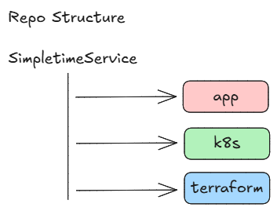

# SimpleTimeService Microservice

## Project Overview
The **SimpleTimeService** is a simple web-based microservice that provides the current timestamp and the IP address of the visitor as a JSON response. It is implemented in Python using Flask and can be deployed remotely using Kubernetes (K8s) on Azure. 

The project structure includes three main components:
1. **App**: Contains the Python code and Dockerfile to package the service into a container.
2. **Terraform**: Contains Terraform code to create necessary resources in Azure, including an Azure Storage Account for remote backend storage.
3. **K8s**: Contains YAML files for deploying the microservice on Kubernetes.

## Project Structure



### Detailed Explanation of Each Folder/Component:

#### 1. `app/` (python Application)
- **Dockerfile**: This file is used to create a Docker image for the microservice. It defines how to build and package the Python application into a container.
- **requirements.txt**: This file lists the Python dependencies for the Flask application. These are the libraries required to run the service, such as `Flask` and `requests`.
- **main.py**: The core Python application that runs the Flask web server. This service responds with the current timestamp and the visitor's IP address as a JSON object.

#### 2. `terraform/` (Infrastructure as Code)
- **main.tf**: Contains the main Terraform configuration. It defines the resources that need to be created in Azure, such as storage accounts, networking, and virtual machines.
- **variables.tf**: Defines the input variables for the Terraform configuration, such as subscription IDs, resource names, etc.
- **outputs.tf**: Defines the output variables for the Terraform configuration, which could include resource IDs or IP addresses of created services.
- **versions.tf**: Specifies the Terraform version and the required provider versions to ensure compatibility.
- **terraform.tfvars**: A variable file where you can specify values for the variables defined in `variables.tf`, such as resource names, locations, and other sensitive data (like API keys).
- **README.md**: A generated documentation file for Terraform resources in the project. It is useful to provide easy-to-understand documentation on what resources are being created and any dependencies.

#### 3. `k8s/` (Kubernetes Deployment)
- **deployment.yaml**: Kubernetes deployment file that describes how the microservice is deployed on Kubernetes, including container images, resource limits, replicas, etc.
- **service.yaml**: Defines the Kubernetes service to expose the microservice to the outside world. It creates a stable endpoint for the app. The service is of type `LoadBalancer` to expose the service externally via a cloud provider's load balancer.
- **hpa.yaml**: Defines the Horizontal Pod Autoscaler (HPA) for the microservice. It automatically adjusts the number of replicas based on CPU utilization or other defined metrics.

## Key Points to Consider

### 1. **Storing Terraform State Remotely**
   - To ensure that the Terraform state is securely stored and managed, we have configured the backend to use Azure Storage Account. This allows the state to be stored remotely, enabling collaboration among team members and preventing potential issues with local state management.
   - The Terraform state is configured to be saved in a blob storage within Azure. This ensures that the state is consistent and can be easily accessed for further operations, such as Terraform plan or apply.

### 2. **Backend Configuration in Terraform**
   - The backend configuration is specified within the `versions.tf` file. 
   - The backend also includes a block that configures the Azure Storage Account and Blob Storage container for managing the Terraform state remotely.

   Example backend configuration:
   ```hcl
   terraform {
     backend "azurerm" {
       resource_group_name   = "your-rg-name"
       storage_account_name  = "yourstorageaccount"
       container_name        = "tfstate"
       key                   = "terraform.tfstate"
     }
   }
   ```

### API Version Compatibility Issue

When using the AKS module, you might encounter an **API version issue**. This occurs because the module’s owner has not updated the AKS API version in the module to reflect the latest API changes from Azure. As a result, the module may throw a warning or error about the outdated API version.

**Important Note**: This issue is **not a blocker** for the deployment process. Despite the API version warning, the AKS module continues to work correctly, and it successfully provisions the AKS cluster and its dependent resources without any impact on functionality.

This API version issue needs to be fixed by the module's owner. However, it doesn't prevent the successful deployment of the AKS cluster, and it will not cause any deployment failures.

